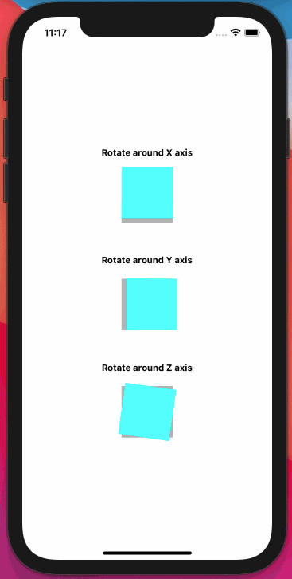

# React Native 3D Rotations

This repo contains the implementation for custom 2D and 3D transformation anchor points (transform origin).
It also contains an animated 3D cube implementation.

The corresponding blog article containing all explanations can be found here:
https://chrizog.com/react-native-rotation-anchor-point

## Example 3D Cube Implementation

    

---

## Example Animated 2D Anchor Point

    

---

## Example Animated 3D Anchor Point (also in z-direction)

    

